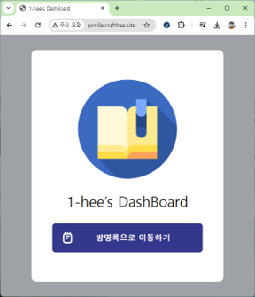
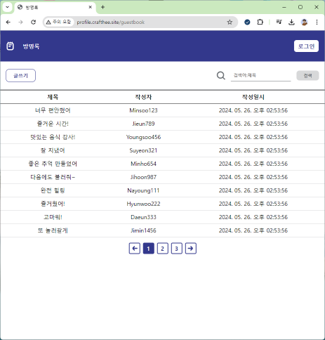
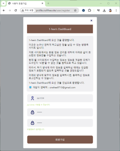
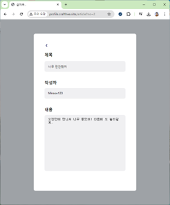

# 📌 프로젝트명 : 1-hee’s Dashboard

> JSP 기반의 개인 방명록 웹 어플리케이션

## 📂 프로젝트 개요

- **개발 기간**: 2024. 05. 04. ~ 2024. 05. 15. (12 일)
- **개발 인원**: 개인 프로젝트 (1인)

## 🛠️ 기술 스택

<ul>
 <li>Java</li>
 <li>Spring</li>
 <li>Logging(slf4j)</li>
 <li>Servlet(Javax)</li>
 <li>JSP/JSTL</li>
 <li>Lombok</li>
 <li>MySQL/MySQL-JDBC</li>
 <li>MyBatis</li>
 <li>Jackson(JSON)</li>
 <li>Springfox-swagger2</li>
 <li>HTML/CSS/JavaScript</li>
</ul>

## ✨ 주요 기능

| 기능 구분 | 설명 |
|------|------|
| 사용자 로그인 및 회원가입     | 로컬 데이터베이스 기반의 사용자 인증 기능 제공 |
| 방명록 글쓰기 (CRUD) 기능     | 로그인한 사용자 정보로 방명록을 작성, 수정, 삭제, 조회 가능 |
| 게시글 소유자 구분 및 접근 제어 | 세션과 쿠키 기반 인증을 통해 사용자별 게시글 접근 권한을 제어 |
| 게시글 검색 및 페이징 처리    | 게시글 제목 검색 기능과 함께 페이징 처리를 적용하여 데이터 응답 성능 개선 |

## 🖼️ 앱 구현 화면

<table>
  <tr>
    <td align="center">
      
    </td>
    <td align="center">
      
    </td>
  </tr>
  <tr>
    <td align="center">
      
    </td>
    <td align="center">
      
    </td>
  </tr>
</table>

## ⚙️ 기술적 배경 및 개선 방향 (AS-IS / TO-BE)

`AS-IS`
- Java 및 Spring 프레임워크를 다룬 프로젝트 경험 필요
- 백엔드 프로그래밍을 통한 애플리케이션의 전체 흐름에 대한 이해 도모
- 사용자 인증/인가 처리, 세션 관리, MVC 아키텍처 등 핵심 개념을 실제로 연습

`TO-BE`
- JSP 기반 SSR 웹 애플리케이션(방명록 서비스)을 직접 구현하며 웹 백엔드 전반의 흐름 학습.
- Session 기반 인증/인가 구현 → 전통적인 로그인 처리 방식에 대한 실습.
- Spring MVC 패턴을 기반으로 컨트롤러, 서비스, 리포지토리 계층의 구조화된 개발 경험.
- 인터셉터를 활용한 로그인 유효성 검증 및 접근 제어 기능 구현 → 보안과 흐름 제어에 대한 이해 향상.
